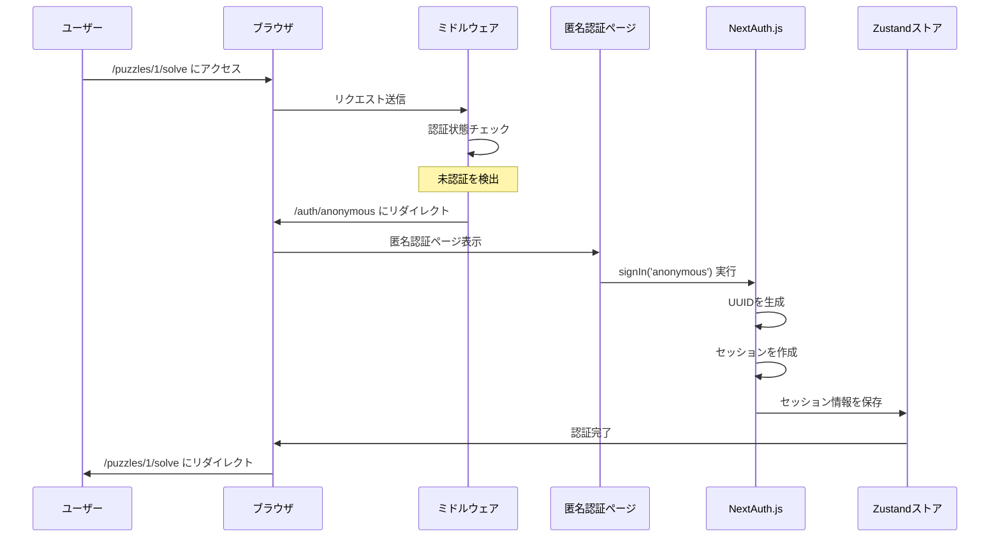

# 動作フロー解説 - 初学者向けガイド

## 目次
1. [全体の動作フロー](#全体の動作フロー)
2. [認証フローの詳細](#認証フローの詳細)
3. [状態管理フローの詳細](#状態管理フローの詳細)
4. [謎解きセッションフロー](#謎解きセッションフロー)
5. [エラーハンドリングフロー](#エラーハンドリングフロー)

## 全体の動作フロー

### 🎯 ユーザーの視点から見た流れ

```
1. ユーザーがサイトにアクセス
   ↓
2. 謎解きページを見つけて「挑戦」ボタンをクリック
   ↓
3. 自動的に匿名ログインが実行される
   ↓
4. 謎解き画面が表示される
   ↓
5. 問題を解いて解答を入力
   ↓
6. 結果画面でタイムとランキングを確認
```

### 🔧 システムの視点から見た流れ

```
1. ブラウザアクセス
   ↓
2. Next.js App Router がページをレンダリング
   ↓
3. ミドルウェアが認証状態をチェック
   ↓
4. 未認証の場合、匿名認証ページにリダイレクト
   ↓
5. NextAuth.js が匿名ユーザーを作成
   ↓
6. Zustand ストアに状態を保存
   ↓
7. 元のページに戻って謎解き開始
```

## 認証フローの詳細

### 1. 初回アクセス時の認証フロー



### 2. 認証状態の確認フロー

```javascript
// ステップ1: ページアクセス時
function PuzzlePage() {
  const { isAuthenticated, isLoading, user } = useAuth()
  
  // ステップ2: 認証状態の判定
  if (isLoading) {
    return <div>認証状態を確認中...</div>
  }
  
  if (!isAuthenticated) {
    return <div>認証が必要です</div>
  }
  
  // ステップ3: 認証済みの場合、コンテンツを表示
  return <div>こんにちは、{user.name}さん</div>
}
```

### 3. セッション同期フロー

```javascript
// hooks/use-auth.ts での同期処理
export function useAuth() {
  const { data: session, status } = useSession()  // NextAuth.js
  const { setSession, clearSession } = useAuthStore()  // Zustand
  
  useEffect(() => {
    if (status === 'loading') return
    
    if (session?.user) {
      // NextAuth.js → Zustand に同期
      setSession({
        userId: session.user.id,
        isAnonymous: session.user.isAnonymous,
        name: session.user.name,
      })
    } else {
      // セッションが無い場合はクリア
      clearSession()
    }
  }, [session, status])
}
```

## 状態管理フローの詳細

### 1. 状態の初期化フロー

```javascript
// アプリケーション起動時
1. Zustand ストアが初期化される
   ↓
2. persist ミドルウェアが localStorage をチェック
   ↓
3. 保存されていた状態があれば復元
   ↓
4. NextAuth.js のセッションと同期
   ↓
5. 最新の状態をコンポーネントに提供
```

### 2. 状態更新のフロー

```javascript
// ユーザーがログアウトボタンを押した場合

// Step 1: UI コンポーネント
function Header() {
  const { signOut } = useAuth()
  
  return <button onClick={signOut}>ログアウト</button>
}

// Step 2: カスタムフック
function useAuth() {
  const { signOut: zustandSignOut } = useAuthStore()
  
  const signOut = async () => {
    await signOut()  // NextAuth.js でログアウト
    zustandSignOut()  // Zustand でも状態クリア
  }
}

// Step 3: Zustand ストア
const useAuthStore = create((set) => ({
  signOut: async () => {
    const { signOut } = await import('next-auth/react')
    await signOut({ redirect: false })
    set({ isAuthenticated: false, session: null })  // 状態更新
  }
}))

// Step 4: 全コンポーネントが自動で再レンダリング
// Header → "ログインしてください" に変更
// PuzzlePage → ログインページにリダイレクト
```

### 3. 永続化フロー

```javascript
// 状態変更時の永続化
Zustand ストアの状態が変更される
       ↓
persist ミドルウェアが変更を検知
       ↓
partialize 関数で保存する項目を選別
       ↓
localStorage に JSON 形式で保存
       ↓
ブラウザを閉じても状態が保持される
```

## 謎解きセッションフロー

### 1. セッション開始フロー

```javascript
// ユーザーが「謎解きを始める」ボタンを押した場合

// Step 1: UI コンポーネント
function StartButton({ puzzleId }) {
  const { startSession } = usePuzzleStore()
  
  const handleStart = async () => {
    // Step 2: セッション開始 API を呼び出し
    const response = await fetch(`/api/puzzles/${puzzleId}/start`, {
      method: 'POST'
    })
    const { sessionId, questions } = await response.json()
    
    // Step 3: ローカル状態を初期化
    startSession(puzzleId, questions.length)
  }
}

// Step 4: Zustand ストアでセッション管理
const usePuzzleStore = create((set) => ({
  startSession: (puzzleId, totalQuestions) => {
    set({
      currentSession: {
        id: generateSessionId(),
        puzzleId,
        startedAt: new Date(),
        currentQuestionIndex: 0,
        totalQuestions,
        segmentTimes: new Array(totalQuestions).fill(0),
        answers: new Array(totalQuestions).fill(''),
        isCompleted: false,
      }
    })
  }
}))
```

### 2. 解答送信フロー

```javascript
// ユーザーが解答を入力して送信した場合

// Step 1: 入力値の取得
function AnswerForm() {
  const [answer, setAnswer] = useState('')
  const { currentSession, updateAnswer, nextQuestion } = usePuzzleStore()
  
  const handleSubmit = async () => {
    // Step 2: ローカル状態を更新
    updateAnswer(answer)
    
    // Step 3: サーバーに解答を送信
    const response = await fetch(`/api/puzzles/${puzzleId}/answer`, {
      method: 'POST',
      body: JSON.stringify({
        questionIndex: currentSession.currentQuestionIndex,
        answer: answer,
        timeSpent: calculateTimeSpent()
      })
    })
    
    const result = await response.json()
    
    // Step 4: 結果に応じて次のアクションを実行
    if (result.isCorrect) {
      if (hasNextQuestion()) {
        nextQuestion()  // 次の問題へ
      } else {
        completeSession()  // 謎解き完了
      }
    } else {
      showError('不正解です')  // エラー表示
    }
  }
}
```

### 3. タイマー管理フロー

```javascript
// リアルタイムタイマーの実装

function Timer() {
  const { currentSession, recordSegmentTime } = usePuzzleStore()
  const [elapsedTime, setElapsedTime] = useState(0)
  
  useEffect(() => {
    if (!currentSession) return
    
    // 100ms ごとに経過時間を更新
    const interval = setInterval(() => {
      const startTime = new Date(currentSession.startedAt)
      const elapsed = Date.now() - startTime.getTime()
      setElapsedTime(elapsed)
    }, 100)
    
    return () => clearInterval(interval)
  }, [currentSession])
  
  // 問題が変わった時にセグメント時間を記録
  useEffect(() => {
    if (currentSession?.currentQuestionIndex > 0) {
      const segmentTime = calculateSegmentTime()
      recordSegmentTime(currentSession.currentQuestionIndex - 1, segmentTime)
    }
  }, [currentSession?.currentQuestionIndex])
}
```

## エラーハンドリングフロー

### 1. 認証エラーのハンドリング

```javascript
// 認証に失敗した場合のフロー

try {
  await signIn('anonymous')
} catch (error) {
  // Step 1: エラーをキャッチ
  console.error('認証エラー:', error)
  
  // Step 2: ユーザーフレンドリーなメッセージを表示
  setError('認証に失敗しました。ページを再読み込みしてください。')
  
  // Step 3: 状態をリセット
  clearSession()
  
  // Step 4: ホームページにリダイレクト
  router.push('/')
}
```

### 2. API エラーのハンドリング

```javascript
// API 呼び出しが失敗した場合のフロー

async function submitAnswer(answer) {
  try {
    const response = await fetch('/api/puzzles/1/answer', {
      method: 'POST',
      body: JSON.stringify({ answer })
    })
    
    if (!response.ok) {
      throw new Error(`HTTP ${response.status}`)
    }
    
    const result = await response.json()
    return result
  } catch (error) {
    // Step 1: エラーの種類を判定
    if (error.message.includes('401')) {
      // 認証エラー → 再ログインを促す
      handleAuthError()
    } else if (error.message.includes('500')) {
      // サーバーエラー → 再試行を促す
      showRetryMessage()
    } else {
      // ネットワークエラー → 接続確認を促す
      showNetworkError()
    }
  }
}
```

### 3. 状態の整合性チェック

```javascript
// 不正な状態を検出した場合のフロー

function validateAndRecoverState() {
  const { currentSession } = usePuzzleStore()
  
  // Step 1: セッションの整合性をチェック
  if (!validateSession(currentSession)) {
    console.warn('不正なセッション状態を検出')
    
    // Step 2: 状態をリセット
    clearSession()
    
    // Step 3: ユーザーに通知
    showError('セッションが無効です。最初からやり直してください。')
    
    // Step 4: 安全なページにリダイレクト
    router.push('/')
  }
}

function validateSession(session) {
  if (!session) return false
  if (session.currentQuestionIndex < 0) return false
  if (session.currentQuestionIndex > session.totalQuestions) return false
  if (session.answers.length !== session.totalQuestions) return false
  return true
}
```

## デバッグフロー

### 1. 開発時のログ出力

```javascript
// Zustand の devtools を使用したデバッグ

const useAuthStore = create(
  devtools(
    (set, get) => ({
      // ストアの定義
    }),
    {
      name: 'auth-store',  // DevTools での表示名
    }
  )
)

// ブラウザの Redux DevTools でアクションの履歴を確認可能
// - setSession が呼ばれた時
// - clearSession が呼ばれた時
// - 状態の変遷を時系列で確認
```

### 2. エラー追跡フロー

```javascript
// エラーが発生した時の情報収集

function ErrorBoundary({ children }) {
  const handleError = (error, errorInfo) => {
    // Step 1: エラー情報を収集
    const errorData = {
      error: error.message,
      stack: error.stack,
      componentStack: errorInfo.componentStack,
      userAgent: navigator.userAgent,
      timestamp: new Date().toISOString(),
      
      // Step 2: 現在の状態も収集
      authState: useAuthStore.getState(),
      puzzleState: usePuzzleStore.getState(),
    }
    
    // Step 3: 開発環境ではコンソールに出力
    console.error('エラーが発生しました:', errorData)
    
    // Step 4: 本番環境では監視サービスに送信（将来実装）
    if (process.env.NODE_ENV === 'production') {
      sendErrorToMonitoring(errorData)
    }
  }
}
```

この詳細な動作フローにより、システムがどのように動作するかを理解し、問題が発生した時の対処方法も把握できます！